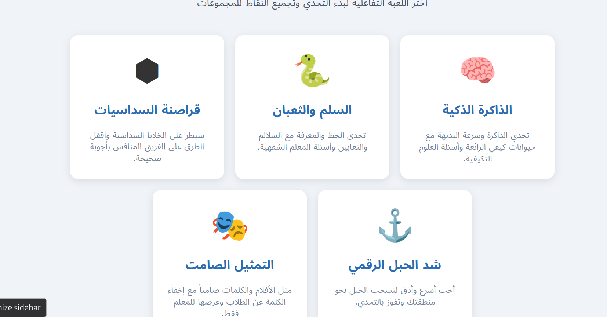

# منصة الألعاب التفاعلية للمجموعات | Interactive Group Games Platform

شاشة اختيار الألعاب التفاعلية المخصصة لتحديات المجموعات وتجميع النقاط، مصممة بطريقة جذابة ومناسبة للبيئات التعليمية والترفيهية لتعزيز التفاعل والمنافسة الإيجابية بين الطلاب.

---

## 🎮 الألعاب المتاحة (Available Games)

تضم المنصة 5 ألعاب تفاعلية رئيسية كما يظهر في تصميم واجهة المستخدم (`image_b2df21.png`):

### 1. الذاكرة الذكية (Smart Memory)
*   **الوصف:** تحدي الذاكرة وسرعة البديهة مع حيوانات كيفي الرائعة وأسئلة العلوم التكيفية.
*   **الهدف:** تنمية مهارات الحفظ، التركيز، والربط السريع بين المفاهيم العلمية.

### 2. السلم والثعبان (Snakes and Ladders)
*   **الوصف:** تحدي الحظ والمعرفة مع السلالم والثعابين وأسئلة المعلم الشفهية.
*   **الهدف:** دمج متعة الألعاب الكلاسيكية بالتقييم الصفي المستمر لكسر جمود المواد الدراسية.

### 3. قراصنة السداسيات (Hex Pirates)
*   **الوصف:** سيطر على الخلايا السداسية واقفل الطرق على الفريق المنافس بأجوبة صحيحة.
*   **الهدف:** لعبة استراتيجية وتنافسية تعتمد على الذكاء وحل المشكلات لفرض السيطرة على الرقعة الرقمية.

### 4. شد الحبل الرقمي (Digital Tug of War)
*   **الوصف:** أجب أسرع وأدق لتسحب الحبل نحو منطقتك وتفوز بالتحدي.
*   **الهدف:** تعزيز عامل السرعة، الدقة، والحماس في المراجعات السريعة بين الفرق.

### 5. التمثيل الصامت (Charades / Mime)
*   **الوصف:** مثل الأفلام والكلمات صامتاً مع إخفاء الكلمة عن الطلاب وعرضها للمعلم فقط.
*   **الهدف:** تشجيع مهارات التعبير الحركي، العمل الجماعي، وتحفيز التفكير الإبداعي والتخمين.

---

## 🚀 المميزات الأساسية (Key Features)

*   **تفاعلية بالكامل:** واجهة مستخدم رسومية (GUI) عصرية تعتمد على نظام بطاقات الألعاب التفاعلية (Interactive Cards).
*   **نظام تنافسي للمجموعات:** مخصصة لدعم التنافس بين الفرق وتجميع النقاط لتعزيز روح العمل الجماعي.
*   **تحكم كامل للمعلم:** ألعاب مثل "التمثيل الصامت" و"السلم والثعبان" تمنح المعلم مرونة كاملة لطرح الأسئلة وتوجيه اللعب.
*   **دعم كامل للغة العربية:** واجهة مستخدم مصممة خصيصاً لتدعم الاتجاه من اليمين إلى اليسار (RTL Support) بخطوط متناسقة وأنيقة.

---

## 🛠️ التقنيات المستخدمة (Tech Stack)

*   **الواجهة الأمامية (Frontend):** HTML5, CSS3 (Flexbox & Grid), JavaScript.
*   **التصميم والحركة:** تأثيرات مرئية سلسة عند التمرير (Hover Effects) وانتقالات حركية ناعمة لضمان تجربة مستخدم ممتازة.
*   **العناصر الرسومية:** أيقونات مسطحة (Flat Icons) وألوان مريحة للعين ومناسبة للمراحل العمرية المختلفة للطلاب.

---

## 📦 التشغيل والتثبيت (Setup and Installation)

المشروع عبارة عن تطبيق ويب تفاعلي، يمكنك تشغيله محلياً عبر الخطوات التالية:

1. قم بعمل استنساخ (Clone) للمستودع:
   ```bash
   git clone https://github.com/your-username/interactive-games-platform.git
   ```
2. انتقل إلى مجلد المشروع:
   ```bash
   cd interactive-games-platform
   ```
3. افتح ملف الـ `index.html` الرئيسي باستخدام أي متصفح إنترنت، أو قم بتشغيله عبر إضافة سيرفر محلي مثل `Live Server`.

---

## 📸 لقطات من الشاشة (Screenshots)

| واجهة اختيار الألعاب الرئيسية |
| :---: |
|  |

---

## 📝 رخصة المشروع (License)

هذا المشروع متاح تحت رخصة **MIT**. يمكنك استخدامه وتعديله وتطويره للأغراض التعليمية والتجارية.
# science_games_platform_v2
# science_games_platform_v2
# science_games_platform_v2
